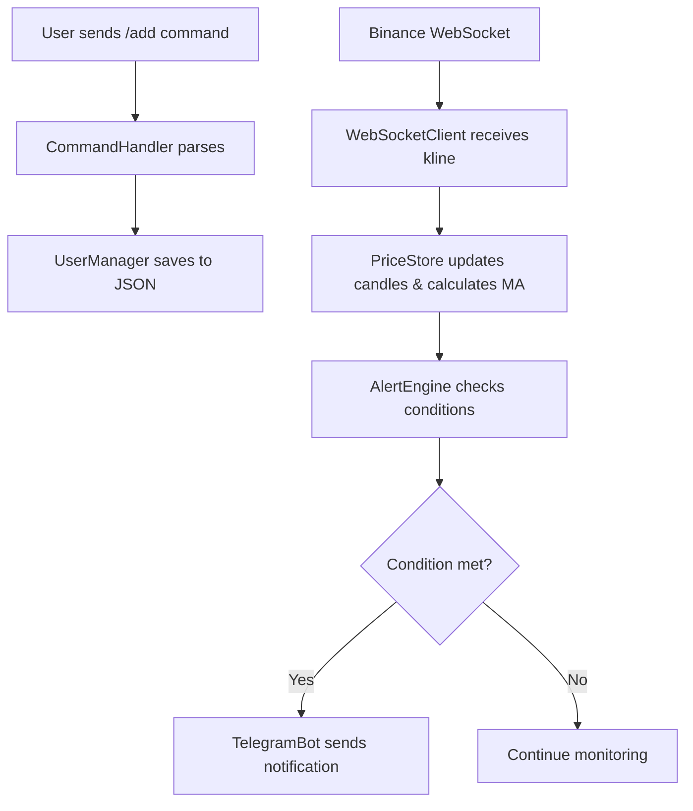

# 🚀 Crypto Alert Bot

A real-time cryptocurrency trading alert system that monitors Binance price data and sends instant notifications via Telegram when your configured conditions are met.

---

## ✨ Features

| Feature | Description |
|---------|-------------|
| **Real-time Monitoring** | Connects to Binance WebSocket API for live candlestick data |
| **3 Alert Modes** | `percent` (% change), `usd` (USD amount), `price` (level threshold) |
| **Moving Average** | Calculates MA based on user-configured timeframe |
| **User Management** | Stores per-user configs, coins, and alerts in JSON |
| **Telegram Integration** | Full command interface via Telegram bot with inline menu |

---

## 🏗️ Architecture

```
┌─────────────────────────────────────────────────────────────┐
│                      app.py (Main)                          │
│  ┌──────────────────┐         ┌──────────────────┐          │
│  │ WebSocket Thread │         │ Telegram Thread  │          │
│  │                  │         │                  │          │
│  │ - Connect to     │         │ - Listen for     │          │
│  │   Binance WS API │         │   /commands      │          │
│  │ - Calculate MA   │         │ - Forward to     │          │
│  │ - Trigger Alerts │         │   handlers       │          │
│  └────────┬─────────┘         └────────┬─────────┘          │
│           │                            │                     │
│           ▼                            ▼                     │
│  ┌──────────────────┐         ┌──────────────────┐          │
│  │   User Manager   │◄───────►│ Command Handler  │          │
│  │ (JSON Storage)   │         │ (/add, /remove...)│          │
│  └──────────────────┘         └──────────────────┘          │
└─────────────────────────────────────────────────────────────┘

Supporting Modules:
├── PriceStore.py    → Stores candle data & calculates MA
├── AlertEngine.py   → Checks alert conditions (percent/USD/price)
└── websocket_client.py → Orchestrates WS connection & message handling
```

---

## 📦 Installation

### 1. Clone the repository

```bash
git clone <your-repo-url>
cd crypto-alert-bot
```

### 2. Install dependencies

```bash
pip install -r requirements.txt
```

**Required packages:**
- `websocket` → Binance WebSocket API
- `requests` → Telegram API calls
- `python-dotenv` → Load `.env` variables

### 3. Configure Telegram Token

Create a `.env` file in the root directory:

```bash
# .env
TELEGRAM_TOKEN=your_telegram_bot_token_here
```

**How to get your token:**
1. Create a bot via [@BotFather](https://t.me/BotFather) on Telegram
2. Use `/newbot` command and follow instructions
3. Copy the API token provided by BotFather

### 4. Start the bot

```bash
python app.py
```

Or use systemd service (if `crypto-alert-bot.service` is configured):

```bash
sudo systemctl start crypto-alert-bot
sudo systemctl status crypto-alert-bot
```

---

## 💬 Usage Guide

### Registration

Start by registering your chat_id:

```
/start → Register your bot
```

### Add Alerts

Use the `/add` command to create alerts for specific coins and conditions:

```bash
# Alert when % change ≥ threshold
/add BTCUSDT percent 0.3   # Alert when price changes ≥ 0.3%

# Alert when USD amount change ≥ threshold
/add ETHUSDT usd 100       # Alert when price changes ≥ $100

# Alert when price hits specific level
/add SOLUSDT price 250     # Alert when price reaches $250
```

### Remove Alerts

Remove alerts for a coin or specific condition:

```bash
/remove BTCUSDT            # Remove all alerts for BTCUSDT
/remove BTCUSDT percent 0.3   # Remove specific alert
```

### View Configs

Check your current alerts and settings:

```bash
/list                      → Show current alerts
/config kline 15m          → Change candle timeframe (default: 1m)
/config malength 20        → Change MA length (default: 14)
/config log 1              → Enable logging mode
/help                      → Show full help menu
```

---

## 📋 Command Reference

| Command | Description | Example |
|---------|-------------|---------|
| `/start` | Register your chat_id | `/start` |
| `/add SYMBOL MODE VALUE` | Add new alert | `/add BTCUSDT percent 0.3` |
| `/remove SYMBOL [MODE] [VALUE]` | Remove alert(s) | `/remove BTCUSDT usd 50` |
| `/list` | View current alerts | `/list` |
| `/config KLINE VALUE` | Set candle timeframe | `/config kline 15m` |
| `/config MA LENGTH` | Set MA length | `/config malength 20` |
| `/config LOG VALUE` | Enable logging | `/config log 1` |
| `/help` | Show help menu | `/help` |

### Alert Modes Explained

| Mode | Description | Example |
|------|-------------|---------|
| `percent` | Trigger when % change ≥ threshold | `/add BTCUSDT percent 0.5` (alert on ±0.5% move) |
| `usd` | Trigger when USD amount change ≥ threshold | `/add ETHUSDT usd 200` (alert on $200+ move) |
| `price` | Trigger when price hits specific level | `/add SOLUSDT price 180` (alert at $180) |

---

## 📁 File Structure

```
.
├── app.py                    # Main entry point (threaded)
├── config/
│   └── users.json           # Per-user configs & alerts storage
├── core/
│   ├── websocket_client.py  # WS connection, message handling
│   ├── telegram_bot.py      # Telegram update listener
│   ├── user_manager.py      # JSON CRUD operations
│   ├── command_handler.py   # Command parsing (/add, /remove...)
│   ├── alert_engine.py      # Alert condition logic
│   └── price_store.py       # Candle storage & MA calculation
├── crypto-alert-bot.service # Systemd service file (optional)
├── requirements.txt         # Python dependencies
├── .env                     # Telegram token config
└── README.md                # This file
```

---

## ⚙️ Configuration Options

### Candle Timeframe (`kline`)

| Value | Description |
|-------|-------------|
| `1m` | 1-minute candles (default) |
| `5m` | 5-minute candles |
| `15m` | 15-minute candles |
| `30m` | 30-minute candles |
| `1h` | 1-hour candles |

### MA Length (`malength`)

Default: `14` (can be changed via `/config malength VALUE`)

---

## 🔄 Data Flow



---

## 🐛 Troubleshooting

### "Missing TELEGRAM_TOKEN in .env"

Ensure your `.env` file exists and contains:
```bash
TELEGRAM_TOKEN=your_token_here
```

### WebSocket connection fails

1. Check if Binance API is accessible
2. Verify `get_symbols()` returns valid symbols from user configs
3. Check console logs for error messages

### Alerts not triggering

1. Verify alert was added correctly with `/list`
2. Check candle timeframe matches your expectations
3. Ensure price movement meets threshold (check logging mode)

---

## 📊 Example Scenarios

### Scenario 1: Volatility Alert
```bash
# Alert when BTC moves more than 0.5% in either direction
/add BTCUSDT percent 0.5
```

### Scenario 2: Breakout Detection
```bash
# Alert when SOL hits $180 (potential breakout)
/add SOLUSDT price 180
```

### Scenario 3: Large Swing Detection
```bash
# Alert when ETH moves more than $200 in value
/add ETHUSDT usd 200
```

---

## 🧪 Testing Tips

- Start with small thresholds to test the system (e.g., `percent 0.1`, `usd 1`)
- Enable logging mode: `/config log 1` to see all price movements
- Use different timeframes to match your trading strategy

---

## 📝 License

MIT License - Feel free to modify and distribute!

---

## 👨‍💻 Support

For issues, questions, or feature requests, check the console logs or open an issue in the repository.

**Happy Trading! 🚀📈**